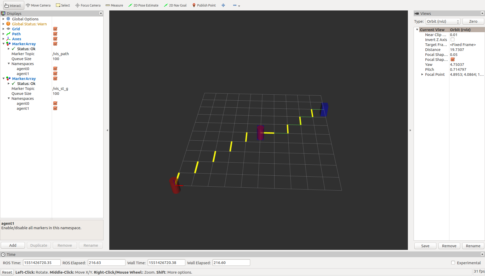
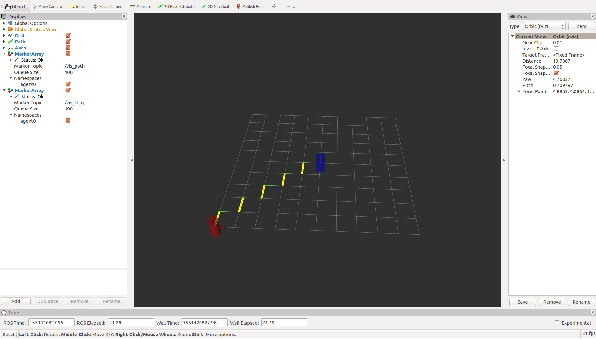
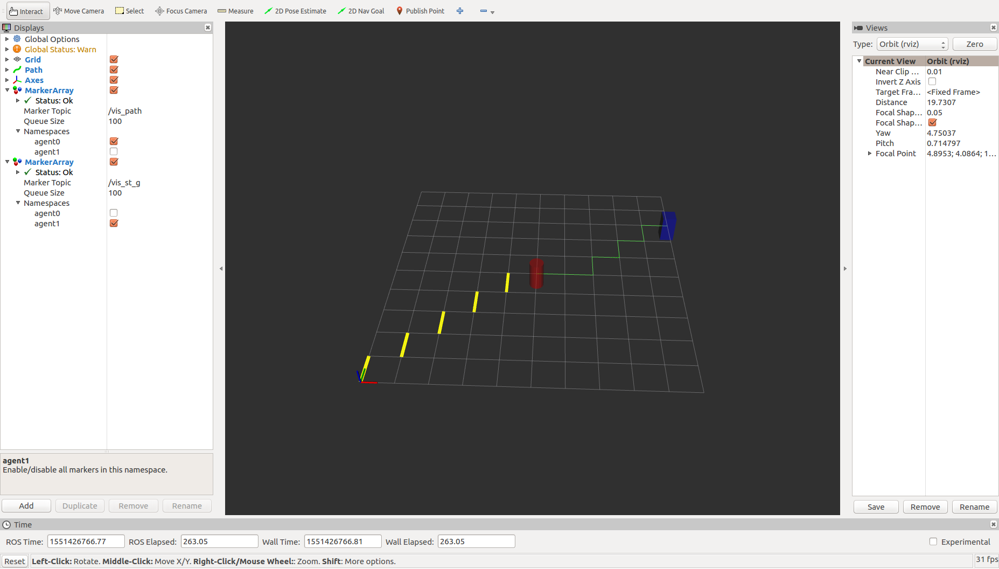
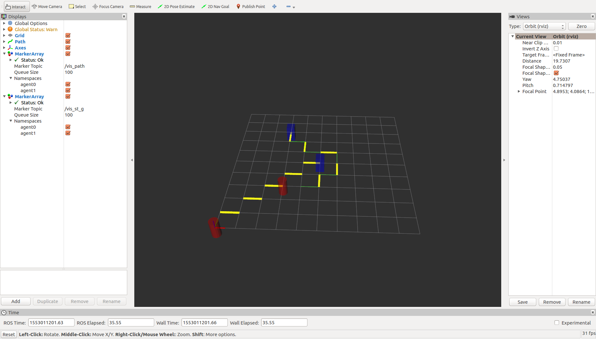

# Muti Agent Path Planning

## Goal:
- the goal of the project is to design a planner can perform multi-agent planning without colliding each other in a grid cell map.

## Test Process:
- fist launch "agent_1" with start position "(0, 0, 0)" and goal "(5, 5, 0)"
- second launch "agent_2" with start postion "(5, 5, 0)" and goal "(10, 8, 0)"

## Method:
1. Build Map:
- this part is designed in the "roadmap.cpp" node, which is contructed as class with "map_" member variable, also I define
"node.h" as the nodes to help construct the map, the idea of building the map is just based on the idea of sparse matrix for
graph search problem, which is faster and save more space than adjacent matrix.

2. Design Planner:
- this part is the core of receving the information from the agent, when the agent's state is called by service , also with the goal, the planner finds the optimal path, and publish with visual marker on rviz, but there lies a problem service is one 
time call, so the publiser "pub_"  has to be published in certain frequency, other wise which won't stay visulized, so I use the timer to make sure it is published in $10hz$ , as for the search algorithm ,I used A*  which is faster just breath first search, becasue of the heristic funtion, also, after fist path is published, I used the obstical map to marked all the nodes in fist path to be unreachable, then when I call the second agent, which will also try to go the shortest path to the goal, but without visiting the first path. That's the core idea behind my stratage, but there needs lots of improvement.....

3. Agent:
- this part is just create a agent to publish its positon

## Result:
the resutlt of the two agents are shown below:

agent 1:

agent 2 with previouse agent 1 path:

Second agent regard fisrt agent path as obstacle

